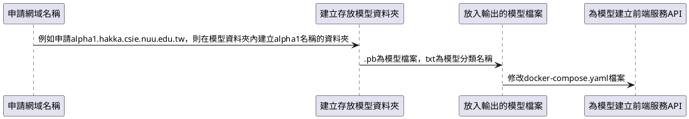
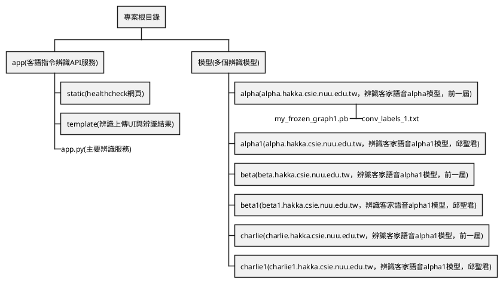

# docker-gpu-speech-command-api-service
[](https://sonarqube.406.csie.nuu.edu.tw/dashboard?id=docker-gpu-hakka-speech-command-api-service-14)
tensorflow speech command example simple api service 

## 前置工作流程
* 輸出模型檔案

## 新增模型服務API流程

## 專案資料夾目錄結構說明1


## 聊天室常用指令
```
# 建立問題
/docker-gpu-hakka-speech-command-api-service issue create 你想要建立的問題名稱
# 執行工作
/docker-gpu-hakka-speech-command-api-service run 要執行的工作名稱
```

# usage 
`sudo docker-compose up -d --build`

# 主機IP
* `IP`: `120.105.128.209`
* `使用者`: `skynet`
